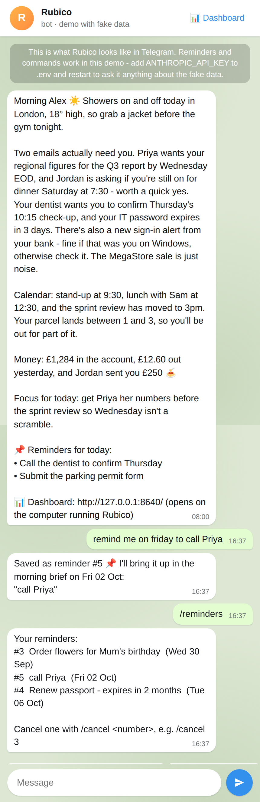
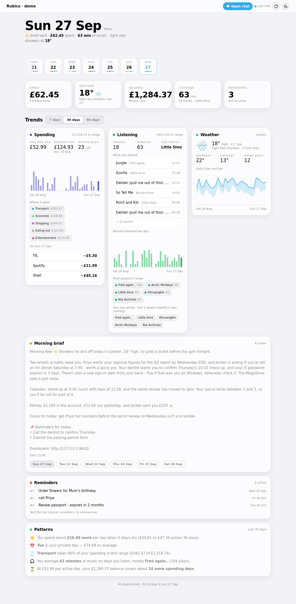
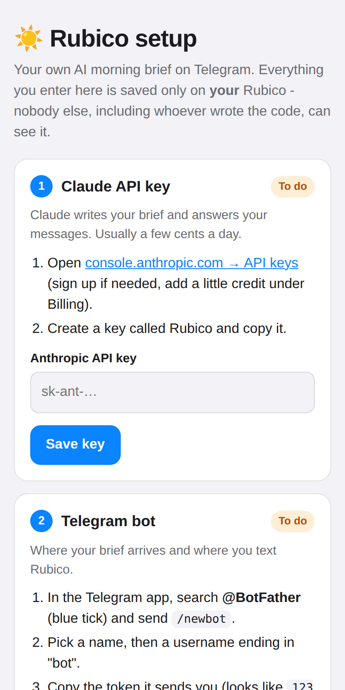

# Rubico ☀️

**Your own AI assistant that texts you a morning brief, and lets you text it back.**

Every morning Rubico reads your email, calendar, bank, music and the weather, and
Claude turns it into a short brief on **Telegram**: what needs a reply, what's on today,
and the one thing worth focusing on. Text it all day to ask questions, reply to emails
or set reminders. Everything also lands on a private **dashboard** you can look back through.

<table>
<tr>
<th width="36%">💬 On Telegram: use it every day</th>
<th>📊 On the dashboard: look back and spot patterns</th>
</tr>
<tr>
<td valign="top"></td>
<td valign="top"></td>
</tr>
</table>

> **Fully open source, and yours alone.** Rubico runs on your own private server in your
> own [Railway](https://railway.com) account, with your own keys. There's no Rubico company,
> account or tracking, and nobody else sees your data, including the people who wrote
> this code. [Privacy details ↓](#-privacy--safety)

---

## 🚀 Get started (about 15 minutes, works from your phone)

Rubico lives on a small cloud server, so your computer never needs to be on, and the
whole setup happens in your browser. No coding and no terminal.

**You'll need:** a free [GitHub](https://github.com) account, the Telegram app, an
[Anthropic API key](https://console.anthropic.com/settings/keys) (Claude usually costs a few
cents a day) and a [Railway](https://railway.com) account (about $5/month, see
[pricing](https://railway.com/pricing)).

1. **Fork** this repo (the **Fork** button at the top of this page).
2. On **Railway**: New Project → Deploy from GitHub repo → pick your fork.
3. Add two **Variables**: `DASHBOARD_PASSWORD` (your choice) and `PORT` = `8080`.
4. Add a **Volume** at `/data`, so your settings survive updates.
5. **Generate a domain**, then open `https://your-address/setup` and follow the cards:
   Claude key → Telegram bot → your city → data sources.

That's it: text your bot `/help` 🎉

**👉 [The full step-by-step guide, with screenshots and troubleshooting](docs/deploy-railway.md)**



---

## 💬 Telegram: your daily assistant

Your morning brief arrives at the time you choose. Reply to it like you'd text a friend:

| Text your bot | What happens |
|---|---|
| *"any emails I need to reply to?"* | Answered from your data |
| *"remind me tomorrow to submit the form"* | Saved, and shows up in tomorrow's brief |
| *"remind me on friday to call Priya"* / *"in 3 days"* / *"on 5 oct"* | Saved for that day |
| *"note to self: buy milk"* | No date given, so it shows up in your next brief |
| `/reminders` · `/cancel 3` | List reminders · cancel #3 |
| *"reply to Jordan saying yes I'm in"* | Drafts it and sends after 10 minutes unless you say `cancel` |
| *"delete the promo emails"* | Uses Gmail's own Promotions tab, then waits 10 minutes |
| *"delete the login alerts from my bank"* | Finds matching emails and shows them to you first |
| `search <question>` | Live web search |
| `studied <topic>` | Review reminders at 1, 3, 7, 14 and 30 days (optional) |
| `/brief` · `/help` | Send the brief now · show everything it can do |

Tap the **menu button** next to the message box in Telegram to see the commands.
Your bot only ever replies to *you*. Messages from anyone else are ignored.

## 📊 Dashboard: your history at a glance

Open your Rubico's web address (or tap the link at the bottom of any brief). It works on
your phone or any browser, and it's protected by your password:

- **Every morning brief you've received.** Flick the day strip to reread any day.
- **Your reminders**, and when each one will come back.
- **Charts** for spending, listening and weather over 7, 30 or 90 days, plus patterns like
  *"you spend £17 more on rainy days"*.
- An **Open chat** button that jumps to your bot, and **⚙️ Settings** to change anything.

---

## ✨ What it can connect to

Pick any mix on the setup page. Everything is optional except Claude and Telegram.

| Source | Adds to your brief | Needs |
|---|---|---|
| 🌦️ Weather | Today's forecast | Nothing, it's free and on by default |
| 📧 Gmail | Emails that need a reply; lets you reply and clean up by chat | A Google account ([safe setup ↓](#-connecting-google-gmail--calendar-with-safety-first)) |
| 📅 Google Calendar | Today's events | A Google account |
| 🏦 Monzo | Balance and yesterday's spending | A UK Monzo account |
| 🎧 Spotify | What you've been listening to | A Spotify account |

You can also set Rubico's **personality** on the setup page: how it talks, how it writes
your email replies, and how long the brief is. Want another source, like Strava, Todoist
or Outlook? [Add it!](#-adding-a-new-data-source)

---

## 🔐 Connecting Google (Gmail & Calendar), with safety first

The **Google** card on your setup page walks you through this and shows the exact address
to copy. Here's what happens and why it's safe.

**You make your own Google "OAuth client".** It's a free key you create in Google
Cloud Console, and it lets *your* Rubico ask Google for access to *your* account.
Because you made it yourself:

- Your login goes **straight from Google to your own Rubico**. There's no company or author in the middle.
- The login is saved on your own storage volume, and nowhere else.
- **You can revoke access any time** at [myaccount.google.com/permissions](https://myaccount.google.com/permissions),
  or with the **Remove** button on the setup page.

**What Rubico asks Google for, and why:**

| Permission | Used for |
|---|---|
| Read Gmail | Your last 24h of email, for the brief |
| Send Gmail | Replies **you asked for**, after a 10-minute cancel window |
| Modify Gmail | Moving emails **you asked to delete** to Trash (recoverable for 30 days). Rubico never permanently deletes anything. |
| Calendar events | Reading today's events, and adding study review events if you turn that on |

When you sign in, Google shows **"Google hasn't verified this app"**. That's expected,
because the app is *yours* and you haven't asked Google to review it. Tap
**Advanced → Go to Rubico → Continue**. The exact steps are in the
[guide](docs/deploy-railway.md#connecting-google-gmail--calendar).

You can connect several Google accounts (e.g. `personal` and `work`), each used for
Gmail, Calendar or both.

---

## 🔒 Privacy & safety

- **Nothing is hosted by us.** Rubico runs on a server *you* rent in *your* own Railway
  account. There's no Rubico account, company server or analytics. Railway (the hosting
  company) runs the machine, like any cloud service.
- **Where your data goes:** only to Anthropic (Claude reads your data to write the brief.
  Anthropic doesn't train on API data by default), to Telegram (to deliver messages to
  you), and to the services you connect.
- **Everything is password-protected.** Every page needs your `DASHBOARD_PASSWORD`, and
  setup forms only accept requests from your own page.
- **Keys are never shown back.** Keys you paste are saved on your own volume and never
  appear on the page again.
- **The bot only talks to you.** Messages from any chat except your own are ignored.
- **No surprise actions.** Email sends and deletes are shown to you first and wait
  10 minutes (you can change this) for a `CANCEL`.

---

## ➕ Adding a new data source

Each source is one small file in [`tools/sources/`](tools/sources/) with the same few
methods: `fetch()` gets real data, `demo()` returns fake data, and `format()` turns it
into text for Claude. Copy [`tools/sources/_template.py`](tools/sources/_template.py),
fill it in, and register it in `tools/sources/__init__.py`. The full walkthrough, including
how to try your changes on your own computer, is in [CONTRIBUTING.md](CONTRIBUTING.md).
Pull requests for new sources are very welcome!

---

## Troubleshooting

| Problem | Fix |
|---|---|
| Brief says "Couldn't reach Gmail personal" | Tap the link in the brief (your setup page) and sign in with Google again |
| "Google hasn't verified this app" | Expected, see [Connecting Google](#-connecting-google-gmail--calendar-with-safety-first) |
| Google logs you out every 7 days | Publish your app on Google Cloud's **Audience** page |
| Bot doesn't reply | Check the deployment is **Active** in Railway, then look at its logs |
| Monzo transactions missing | Approve access in the Monzo app. Balance still works without it. |
| Anything else | See the [full troubleshooting table](docs/deploy-railway.md#troubleshooting) |

---

## Project layout

```
docs/deploy-railway.md   the setup guide
Dockerfile, railway.json how Railway builds and runs Rubico
run.py                   starts everything (web page, bot, morning brief)
tools/                   the scripts that do the work (see CLAUDE.md)
  web_setup.py             the /setup page
  orchestrator.py          builds and sends the morning brief
  chat_listener.py         Telegram chat, actions and commands
  reminders.py             notes & reminders
  sources/                 one file per data source
workflows/               plain-English guides for each job
dashboard/               the dashboard page (a single file, no build step)
config.example.yaml      every setting, explained
demo.py, tests/          for contributors (see CONTRIBUTING.md)
```

## License

[MIT](LICENSE). Free to use, change and share.
